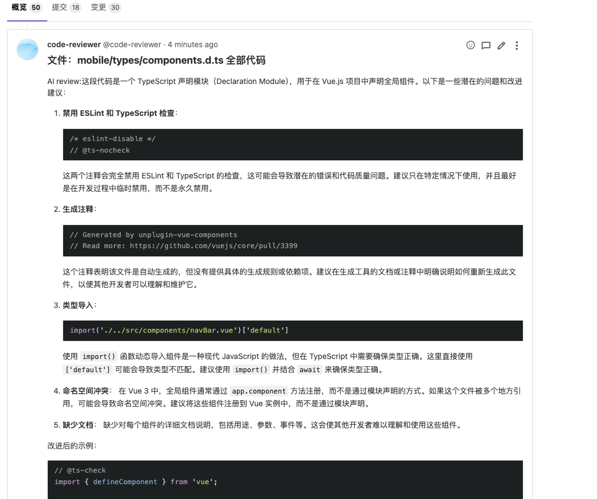

# AI-code-review

[](https://opensource.org/licenses/MIT)

[English](./README.md) | 中文

基于 **LangChain + GitLab** 的可扩展 AI 代码评审工具。
团队规范以 Skills 形式按需注入到 Prompt，支持本地 / Webhook 两种触发方式，
内置 Skill 单测框架、LangSmith 追踪与本地 token / 命中率统计。



---

## 功能特点

- **LangChain 化的链路**：模型层走 OpenAI 兼容协议（DashScope / DeepSeek / OpenAI / 自建网关均可），结构化输出 + 重试 + 并发并发开箱即用。
- **Skills 体系**：把公司开发规范写成 `standards/<lang>/<rule>.md`，YAML front-matter 描述触发条件，正文按命中情况注入 Prompt。
- **硬匹配 + 语义匹配兜底**：硬规则覆盖典型场景，embedding 语义检索兜底防漏（带本地缓存）。
- **Skill 单测框架**：每条规范配套 `<skill>.tests.yml` 用例，覆盖违例样例 / 合规样例，支持 `--no-ai` 零成本快速门。
- **可观测性**：本地终端 rich 表格打印 token & skill 命中分布；可选接入 LangSmith 做 trace。
- **两种触发模式**：CLI（替代 cron）或 FastAPI Webhook（MR 一开即审，带 dedupe + Semaphore 并发控制）。

---

## 项目结构

```
.
├── app/
│   ├── settings.py              # pydantic-settings 配置
│   ├── chains/                  # LangChain 链：schemas / prompts / review_chain
│   ├── skills/                  # Skill 加载、调度、语义索引
│   ├── adapters/                # GitLab IO / diff 解析 / 语言识别
│   ├── pipeline/                # 编排：拉文件 → 选 skill → 并发审查 → 回写评论
│   ├── testing/                 # Skill 单测运行器
│   ├── webhook/                 # FastAPI Webhook 服务
│   ├── observability.py         # LangSmith + 本地 UsageCollector
│   └── cli.py                   # Typer CLI 入口
├── standards/                   # 团队规范库（每条规范一个 .md + 一个 .tests.yml）
│   ├── general/
│   ├── java/
│   └── python/
├── config.example.yml           # 配置示例
├── main.py                      # 向后兼容入口（等价于 review today）
└── requirements.txt
```

---

## 安装

```bash
git clone https://github.com/meate-onlines/AI-code-review.git
cd AI-code-review
pip install -r requirements.txt
cp config.example.yml config.yml      # 填入真实 token / api_key
```

---

## 使用

### 1. 本地一次性审查（替代旧 `main.py`）

```bash
# 审查今天有更新的所有 MR
python -m app.cli review today

# 审查指定 MR（本地调试）
python -m app.cli review mr <project_id> <mr_iid> -v

# 离线跑单文件审查（不写评论，调 prompt 用）
python -m app.cli review file path/to/Foo.java
```

### 2. Webhook 模式（实时审查，推荐生产使用）

```bash
# 启动服务
python -m app.cli serve

# 或直接 uvicorn
uvicorn app.webhook.app:create_app --factory --host 0.0.0.0 --port 8000
```

然后在 **GitLab → Project → Settings → Webhooks** 添加：

| 字段 | 值 |
|---|---|
| URL | `https://<host>/gitlab/webhook` |
| Secret Token | 与 `config.yml` 中 `webhook.secret` 一致 |
| Trigger | 勾选 **Merge request events** |

健康检查与指标：

- `GET /healthz` — 活性探针
- `GET /ready` — 就绪探针（探测 GitLab 连通）
- `GET /usage` — JSON 返回累计 token / skill 命中

### 3. Skills 相关

```bash
# 查看加载到的所有规范
python -m app.cli skills list

# 给定文件路径预演命中
python -m app.cli skills match src/main/java/com/foo/UserMapper.xml

# 跑规范的单测（含 AI 调用）
python -m app.cli skills test
python -m app.cli skills test --skill java-naming-convention -v

# 只校验触发器，不调 AI（零成本，CI 必跑）
python -m app.cli skills test --no-ai

# 语义索引管理
python -m app.cli skills index status
python -m app.cli skills index rebuild
```

---

## 配置说明（`config.yml`）

完整字段见 `config.example.yml`，关键段落：

```yaml
ai:
  base_url: "https://dashscope.aliyuncs.com/compatible-mode/v1"
  api_key: "sk-xxxx"
  model: "qwen-coder-plus"

review:
  include_patterns: ["**/*.java", "**/*.py", ...]
  exclude_patterns: ["**/generated/**", ...]
  concurrency: 4
  comment_min_severity: warning

skills:
  enabled: true
  standards_dir: "standards"
  hard_match_floor: 2          # 硬匹配 < 2 时启用语义兜底
  semantic:
    enabled: false             # 需要时打开；模型默认复用 ai.* 的 api_key
    model: "text-embedding-v3"
    min_score: 0.55

webhook:
  enabled: true
  port: 8000
  secret: "<change-me>"
  max_concurrent_reviews: 2
  dedupe_ttl_seconds: 1800

langsmith:
  enabled: false               # 关掉也能用本地 usage summary
  api_key: "lsv2_pt_xxxx"
  project: "ai-code-review"
  local_summary: true
```

所有字段都支持环境变量覆盖：`REVIEW__AI__API_KEY=...`、`REVIEW__WEBHOOK__SECRET=...`。

---

## 新增一条团队规范

1. 在 `standards/<lang>/` 下新建 `<name>.md`：

   ```markdown
   ---
   name: java-log-spec
   description: Java 日志规范。审查所有写日志的 Java 代码时使用。
   severity: warning
   triggers:
     languages: [java]
     file_patterns: ["**/*.java"]
     keywords: ["log.", "logger."]
   tags: [java, logging]
   ---

   # Java 日志规范
   ## 规则
   ...
   ## 反例
   ...
   ## 正例
   ...
   ```

2. 同目录建 `<name>.tests.yml` 配套测试用例（违例样例 + 合规样例各几条）。
3. `python -m app.cli skills test --skill java-log-spec` 验证。
4. 如果开启了语义匹配：`python -m app.cli skills index rebuild`。

---

## 贡献指南

1. Fork 项目
2. 新建分支
3. 提交改动（建议同时附 Skill 单测）
4. 提交 Pull Request

---

## 许可证

本项目采用 [MIT License](LICENSE) 许可。

---

## 联系方式

- 邮箱：fmj_lg@163.com
- GitHub：[meate-onlines](https://github.com/meate-onlines)

---

## 致谢

- [LangChain](https://www.langchain.com/)
- [python-gitlab](https://python-gitlab.readthedocs.io/)
- [Alibaba Cloud DashScope (Qwen)](https://help.aliyun.com/zh/dashscope/)
- [FastAPI](https://fastapi.tiangolo.com/)
